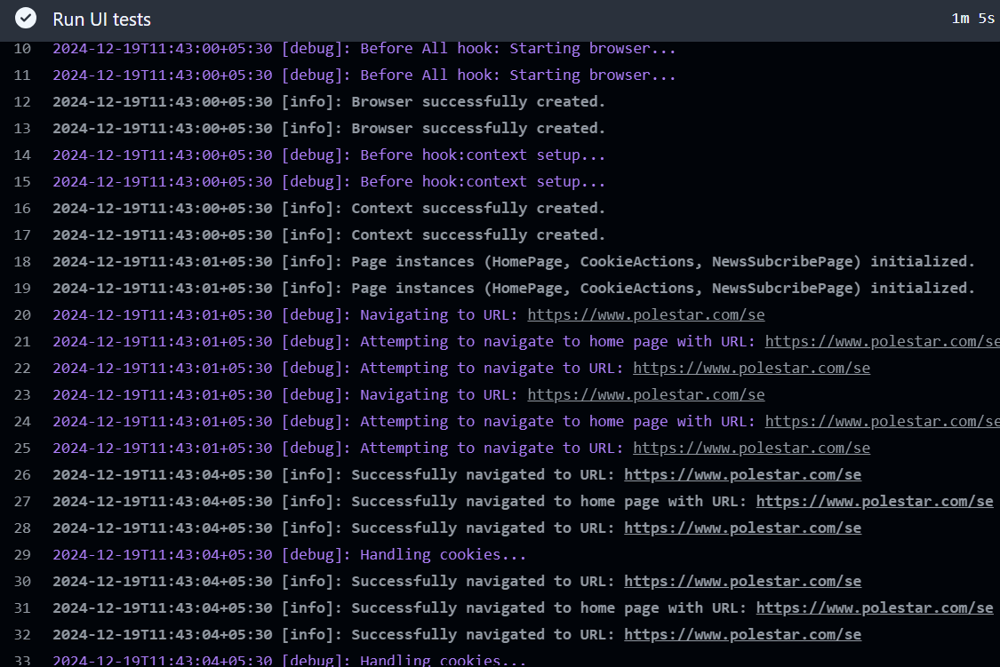

# Polestar QA Tests

## Pre-requisites

### Below applications to be installed

- node.js [https://nodejs.org/en/download/package-manager]
- vs code [https://code.visualstudio.com/download]
- k6 [https://grafana.com/docs/k6/latest/set-up/install-k6/]
- playwright (install typescript) [https://www.npmjs.com/package/playwright]
- cucumber [https://www.npmjs.com/package/@cucumber/cucumber/v/9.5.1]
- cucumber plugin in vscode [https://marketplace.visualstudio.com/items?itemName=CucumberOpen.cucumber-official]
- ts-node [https://www.npmjs.com/package/node-ts]

### Actions Points Covered

1. Added the **frontend**, **backend** and **k6-performance** test cases.
2. Implemented in **Page Object Model**.
3. Implemented **Behavioral-Driven** Test cases.
4. Implemented **Module** based test execution.
5. Implemented **Singleton class** file.
5. Handled the **parallel** execution.
6. configured **azure & gitHub Actions yaml** with reports and artifacts publish feature.
8. Handled **cross browser testing** (chromium, firefox were enabled, we can run in any other browsers too as per our business requirement).
9. **Reports** generation in pipeline.
10. Recording **video and Screenshot** in pipeline.
11. **Tracing** the testcase ran in pipeline.
12. Custom **logging** in UI test case and **Error handling** in BE test cases.

## Frontend Tests

This project consists on the frontend test cases on the link https://www.polestar.com/se

- Validated the testcases to test the discover and ready for delivery links check.
- Validated the subcription of news process for Polestar.

### Command to run the frontend test

```
npm test-ui
```
### Custom Execution (using tags)

- I have included the 'tag' parameter to couple of test cases. Given value as '@smoke'.
- We can run that two specific test cases by using the tag '--grep' as shown in below command.

```
npm test-ui-smoke

npm test-ui-regression
```

## Backend Test

This project consists on the backend test cases on the link https://reqres.in/

- Implemented the test cases with GET, POST, PUT and DELETE http methods.
- Implemented the request specifications in RequestSpec.js file in utils.

### Command to run the backend test

```
npm test-api
```

## k6-performance Test

This project consists on the k6 performance test case on the link https://www.polestar.com/se/test-drive/booking/ps4/

- Implemented the GET call performance test case with virtual users of 25vu.

### Running k6 test

- Run the below commans to run script.js for windows run

```
npm test-k6
```
- you will see the report like this below screenshot 

## Azure pipeline set-up

- I have configured the pipeline stages in such a way that the playwright test can run in the azure pipeline and the json report & artifacts will be published as well. We can find it in azure-pipeline.yml file

## GitHub Actions

- I have integrated the github action pipeline also. pipeline-triggr.yml is provided under './github/workflows' path. I have published the artifactes and reports in pipleline.


## Allure Reports

- Install allure reports package using below command

``` bash
npm i allure-cucumberjs
```
- I am hosting the results of the test cases in the github pages.
- As soon as the test cases ran, peaceiris/actions-gh-pages in yml file will automatically handle gh-pages to host my report
- We can see the reports details as shown in below



## Playwright Traces

- I have included the amazing feature of playwright i.e., playwright traces.
- We can find it in following path 'traces'
- files will get saved with time date and test case number.
- In pipeline we can download traces from the artifacts and view the traces as shown below.


### Playwright Traces View

- There are two different ways to view the traces.
  1. We can upload the 'trace***.zip' file in the following link: https://trace.playwright.dev/

  2. If playwright is installed in the local system we can go to the 'trace***.zip' location and run the below command
  
    ```
    npx playwright show-trace <tracefilename.zip>
    ```  

### Custom logging and Error Handling

- I have used _winston_ library of npm to have custom logging. Handled the generic util file for logging configuration.
- Below are the libraries that are used:
    ```
    npm i winston

    npm i moment-timezone
    ```  
- All UI test cases use the generic logging util file and log in console, and _test_run.log_ file under Logging folder.
- I ahve used _ErrorHandler_ for BE test cases to handled any unexpected error while interacting api's.

- ref: 
  winston - logging [https://www.npmjs.com/package/winston]
  
  time zone - moment timezone [https://www.npmjs.com/package/moment-timezone]

### Tech stack used

- Node.js
- Playwright
- JavaScript
- k6
- yaml 


